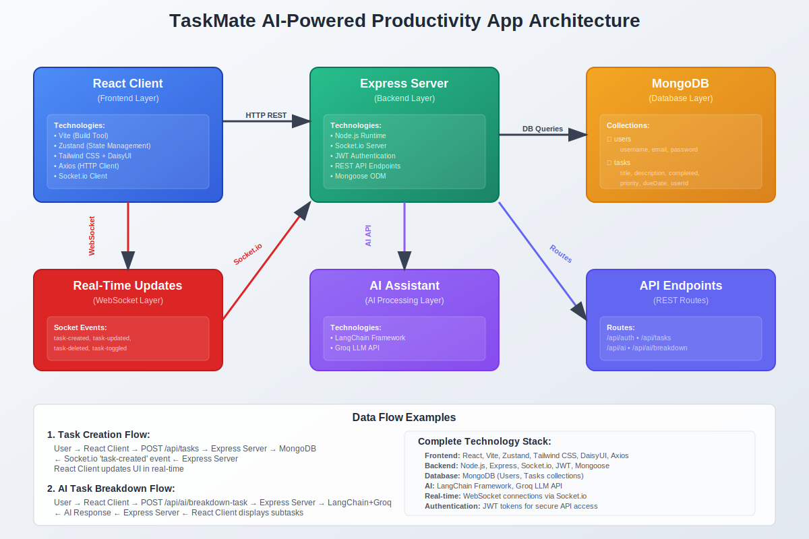

# TaskMate AI 🚀

An AI-powered MERN stack productivity application designed to streamline your workflow with real-time task management, secure authentication, and an intelligent assistant.

---

## Architecture

  

---

## Features

- **Secure User Authentication:** Robust user authentication powered by JSON Web Tokens (JWT) for secure access.
- **Real-time Task Management:** Instantly update and synchronize tasks across all devices using Socket.io.
- **AI Productivity Assistant:** Leverage the power of Groq API for intelligent productivity tips, task breakdowns, and helpful suggestions.
- **Modern & Responsive UI:** A sleek, intuitive, and fully responsive user interface built with React, Tailwind CSS, and daisyUI.
- **Comprehensive Task Tracking:** Efficiently manage tasks with features for priority setting, due date tracking, and status updates.

---

## Tech Stack

  
  
  
  
  
  
  
  
  
  

---
